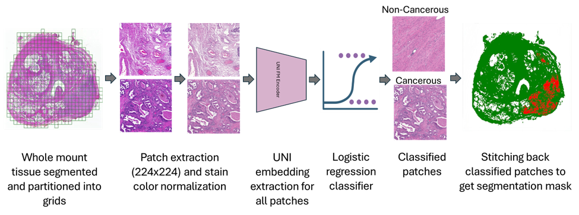

# WSI-Segmentation using UNI2 - ShiradkarLab_IU  
**Computational Pathology Pipeline for Prostate Cancer Feature Extraction and Cancer Segmentation on WSI**

This repository provides a modular, high-throughput pipeline for processing Whole Slide Images (WSIs) using the **UNI2-h** foundation model. It handles the full lifecycle of digital pathology data: from raw slide patching to final diagnostic heatmap reconstruction.

---
## Pipeline

---

## Citation

If you use this repository, models, or pipeline in your research, please cite:

```
@inproceedings{bogale2026foundation,
  title={Foundation-model-based prostate cancer segmentation on digitized H\&E prostate pathology},
  author={Bogale, Yamlak and Collins, Katrina and Sonawane, Sumedh and Feldman, Michael and Bahler, Clinton and Shiradkar, Rakesh},
  booktitle={Medical Imaging 2026: Digital and Computational Pathology},
  volume={13932},
  pages={62--68},
  year={2026},
  organization={SPIE}
}
```
---

## Quick Start 

### Installation & Environment Setup

Clone the repository and install dependencies (including `timm`, `huggingface_hub`, `h5py`, and `openslide`):

```bash
git clone https://github.com/yamlakyam/WSI-Segmentation-UNI2.git
cd WSI-Segmentation-UNI2
bash setup.sh


Organize your raw .svs or .tif slides and link them into the project structure, then run the full pipeline sequentially:


# Data Preparation
mkdir -p ./data/WSI

# Link your WSI dataset to the local data directory
ln -s /path/to/your/raw/wsis/* ./data/WSI/

# -------------------------------
# Execution Pipeline (End-to-End)
# -------------------------------

# Step 1: Patch Extraction (224x224 patches from tissue regions)
python src/preprocessing/extract_patches.py

# Step 2: Directory Flattening (organize patches for batch processing)
python src/preprocessing/flatten_patches.py

# Step 3: Stain Normalization (Macenko normalization)
python src/preprocessing/normalize_stains.py

# Step 4: UNI2-h Feature Extraction (requires Hugging Face token)
python src/inference/extract_features.py --token "YOUR_HF_TOKEN"

# Step 5: Patch Classification (predict cancer probability per patch)
python src/inference/classify_h5.py \
  --h5 "patch_embeddings.h5" \
  --model "models/prostate_uni2_model.joblib" \
  --output "patch_predictions.csv"

# Step 6: Full WSI Heatmap Reconstruction (generate diagnostic maps)
python src/postprocessing/full_wsi_heatmap.py \
  --csv "patch_predictions.csv" \
  --out "results/WSI_Heatmaps"


  Project Structure

  .
├── data/
│   ├── WSI/                  # Raw Whole Slide Images (Source)
│   └── all_patches/          # Processed and normalized patches
├── models/
│   └── prostate_uni2_model.joblib  # Linear probe checkpoint
├── src/
│   ├── preprocessing/        # Patching and normalization logic
│   ├── inference/            # Embedding extraction and classification
│   └── postprocessing/       # Heatmap stitching and WSI reconstruction
├── results/
│   └── WSI_Heatmaps/         # Final diagnostic probability maps
├── setup.sh                  # Environment configuration
└── README.md


